# AnvilCode

**本地 AI Agent 运行时** —— 把「用户目标 → Agent Loop → 模型推理 → 工具调用 → 结果回填 → 事件展示 → 会话续航」整条链路做成一个可运行、可观测、可干预的工程实现。

不是"调大模型 API 的脚本"，也不是单进程 demo。`anvil-core` 是常驻守护进程，CLI 和 TUI 是它的客户端，三者通过类型化 JSON-RPC 协议通信。

> **设计和动机的完整论证见 [DESIGN.md](DESIGN.md)** —— 为什么做（动机与失效模式）、业界方案对比、每条设计决策解决什么问题、以及用实验逐条取证的闭环核对。

```
anvil / anvil-tui  ──JSON-RPC 2.0 over NDJSON──▶  anvil-core (daemon)
       │                                                  │
       └──────────── event.subscribe ◀────────────────────┘
```

## 为什么拆双进程

单进程 demo 能跑通 Agent Loop，但后面每个能力都会被架构卡住。一开始就把边界立住，换来的是：

- **客户端崩溃不带崩任务** —— 守护进程继续跑，重连后 `replay_from_run` 能补齐历史事件
- **多前端复用同一套通道** —— CLI、TUI、未来的 Web 复用同一个 Core
- **协议边界强制契约化** —— IPC 是进程边界，字段漂移是分布式系统里最贵的一类 bug
- **执行过程可订阅** —— token 流、工具调用、权限审批都走同一条事件流

## 分层架构

```mermaid
flowchart TB
    subgraph L1["入口层"]
        A1["用户目标<br/>goal / chat / slash"]
        A2["anvil CLI<br/>run / chat / trace"]
        A3["anvil-tui<br/>终端实时交互"]
    end

    subgraph L2["协议层"]
        B1["JSON-RPC 2.0<br/>命令 / 响应 / 通知"]
        B2["NDJSON over TCP<br/>逐行帧传输"]
        B3["event.subscribe<br/>topic / scope 订阅"]
    end

    subgraph L3["运行时核心层"]
        C1["anvil-core daemon<br/>常驻执行体"]
        C2["SocketServer<br/>连接与消息分发"]
        C3["CoreApp<br/>命令路由入口"]
        C4["SessionManager<br/>session / run 生命周期"]
        C5["AgentRunner<br/>组装上下文 / 模型 / 工具"]
    end

    subgraph L4["Agent 能力层"]
        D1["AgentLoop<br/>think → tool_use → observe"]
        D2["LLM Provider<br/>stream / retry / prompt cache"]
        D3["ToolRegistry<br/>工具注册 / 发现 / 路由"]
        D4["内建工具<br/>read / write / list / bash"]
        D5["任务工具<br/>task_create / update / list"]
    end

    subgraph L5["治理与记忆层"]
        E1["Pydantic 校验<br/>工具参数边界"]
        E2["PermissionManager<br/>allow / deny / always"]
        E3["thread.jsonl<br/>完整消息回放"]
        E4["notes.md<br/>Agent 自留事实"]
        E5["context / compact<br/>上下文水位与压缩"]
    end

    subgraph L6["扩展生态层"]
        F1["Skills<br/>slash / prompt / 工具白名单"]
        F2["Subagents<br/>planner / executor / reviewer"]
        F3["子 AgentLoop<br/>隔离上下文"]
        F4["MCP Client<br/>tools/list / tools/call"]
        F5["MCP Servers<br/>外部工具生态"]
    end

    subgraph L7["结果与证据层"]
        G1["最终结果<br/>回答 / 文件 / 任务产物"]
        G2["TUI 实时渲染<br/>token / tool / permission"]
        G3["events.jsonl<br/>run 级事件证据"]
        G4["trace.ndjson<br/>IPC / event / LLM 时间线"]
        G5["~/.anvil/sessions<br/>thread / notes / runs"]
    end

    L1 --> L2 --> L3 --> L4 --> L5 --> L6 --> L7
```



## 核心机制

### Agent Loop

`core/loop.py` 是 plan → act → observe 循环：

1. 调 LLM（流式），拿到 `stop_reason` 和 content blocks
2. 把 assistant 内容追加进上下文 —— **thinking block 必须排在首位且带 signature 原样回传**，否则扩展思考模式会被 API 拒绝
3. `stop_reason == "tool_use"` 时逐个执行工具，结果作为 `tool_result` 回填
4. 工具执行出错**不中断循环**，而是把错误文本作为 tool result 交回模型，让模型自己纠错
5. `end_turn` 结束；`max_tokens` 截断在工具调用中间时，补一条合成错误结果保持消息序列平衡

### 类型化 IPC 与协议契约

所有 IPC 消息是 pydantic v2 在 `type` 字段上的**判别联合**（`core/bus/commands.py`、`core/bus/events.py`）。handler 抛 `HandlerError` 后由 `SocketServer` 统一转成标准 JSON-RPC 错误响应。

`WIRE_PROTOCOL.md` **由模型自动生成**（`scripts/gen_protocol_doc.py`），并且 `make verify-s0` 里有 `--check` 模式：模型改了文档没改，验证直接失败。这样"文档撒谎"在机制上不可能发生。

### 事件流与三层可观测性

`EventBus` 之上挂了三个消费者：

- **`EventWriter`** —— 每个 run 一份 `events.jsonl`，run 级事件证据
- **`IpcEventBroadcaster`** —— 推给订阅的客户端，支持 topic glob（fnmatch）+ scope（`global` / `run:<id>`）
- **`TraceWriter`** —— 系统级时间线，分 `ipc` / `event` / `llm` 三层，标注 `CORE→CLIENT`、`CLIENT→CORE`、`CORE→LLM`、`LLM→CORE`，带 `latency_ms`

`event.subscribe` 支持 `replay_from_run`：**先从 `events.jsonl` 回放历史事件，再切入实时流**，所以晚连接的客户端能补齐。

一个容易忽略的并发细节：`SocketServer` 对每条命令 `asyncio.create_task` 独立执行、**故意不 await**。否则跑 agent run 的长任务会阻塞读循环，`permission.respond` 永远投递不进来 —— 审批和执行必须并发，"等审批"这件事才能成立。

### 工具调用链路

`core/tools/invocation.py` 里单次调用是：

```
schema 校验 → 权限审批 → 限时执行 → 失败分类 → 指数退避重试
```

只有 `runtime_error` 和 `rate_limited` 会重试（退避 2s、4s）；`timeout`、`schema_error`、`permission_denied` 直接返回。失败一律转成 `ToolResult(is_error=True)` 交回模型。

工具以 `BaseTool` 抽象 + `params_model`（pydantic）声明参数边界，运行时统一校验。内建 9 个工具，加上 `spawn_agent` / `agent_result` 共 11 个。

### 权限模型

6 级评估，**顺序本身就是安全设计**（`core/permissions/manager.py`）：

| 级别 | 规则 | 能否被缓存绕过 |
|---|---|---|
| 1 | `deny_patterns`（bash） | — |
| 2 | cwd 越界启发式 → 强制 ASK | **否** |
| 3 | session 级 always 缓存 | — |
| 4 | 持久化 always 缓存（`~/.anvil/policy.toml`） | — |
| 5 | `allow_patterns`（bash） | — |
| 6 | 工具默认策略 | — |

第 2 级排在第 3、4 级**之前**，所以用户点过"永久允许"也绕不过越界检测。启发式覆盖绝对路径、`~`、`..`、`$HOME`、`$PWD`、显式 `cd`。

审批走 `asyncio.Future` + `wait_for(timeout)`；客户端断连时 `cancel_session` 会把该 session 所有 pending 请求 resolve 成拒绝，**避免协程永久挂起**。

### 上下文治理

- `context_pct` 用**真实的 `usage.input_tokens`** 除以模型 context window，不是估算
- 触达阈值后自动压缩，产出固定 6 段式交接摘要：目标 / 已完成 / 关键约束 / 当前文件状态 / 剩余 TODO / 关键数据，并明确告知模型"另一个 LLM 实例只会拿到你的摘要，必须自包含"
- 摘要落盘为 `summary_<ts>.md`，同时发 `ContextCompactedEvent` 带 original/summary token 数，可审计
- 压缩时机卡在「工具结果追加完毕、且消息尾部是 user」之后 —— 只有在这个位置，压缩结果 `[summary, ack]` 对下一次调用才是合法消息序列
- 超长 `tool_result` 截断保留前缀，并提示"完整输出在 run events 里"
- 读取历史时裁剪尾部**未配对的 `tool_use`**（Anthropic API 要求 tool_use/tool_result 严格配对，否则 `messages.invalid`）

### 会话与分层记忆

```
~/.anvil/sessions/<session-id>/
├── meta.json          # session 元信息、状态、run 列表
├── thread.jsonl       # append-only 完整消息，逐行容错（坏行跳过不毁会话）
├── notes.md           # Agent 通过 note_save 主动写入的持久事实
├── summary_*.md       # 每次压缩的摘要留痕
└── runs/<run-id>/
    ├── events.jsonl   # 该 run 的全部事件
    └── .tasks/        # 任务系统落盘
```

记忆分三层注入 system prompt：`~/.anvil/context.md`（全局）→ `.anvil/context.md`（项目）→ `notes.md`（会话）。`thread.jsonl` 是完整回放源，不是简单拼接历史。

### 扩展能力

- **Skills** —— Markdown + YAML frontmatter，三级覆盖（项目 → 用户全局 → 内建），支持目录式 `name/SKILL.md`；用 `/skill-name args` 触发，`$ARGUMENTS` 模板替换；skill 可以用 `allowed_tools` **收敛工具白名单**
- **Subagents** —— 冷启动隔离上下文（工具描述里明确告知"子 agent 看不到父对话，必须写全"）；支持前台阻塞和后台并行；嵌套深度上限 2；子事件总线的所有事件桥接到父总线，TUI 因此能渲染嵌套进度；后台任务经 `BackgroundTaskRegistry` 注册，用 `agent_result` 轮询取结果
- **MCP** —— stdio 与 TCP 双传输；stderr 用后台 task 持续排空（否则子进程管道缓冲区满会阻塞）；64MB per-frame 上限防 `LimitOverrunError`；JSON-RPC id 用字符串比较以兼容返回字符串 id 的服务端；跳过 server 主动 notification

## 快速开始

```bash
# 依赖（需要 uv）
uv sync

# 配置
cp .env.example .env
# 填入 ANTHROPIC_API_KEY（或 ANTHROPIC_BASE_URL 指向兼容网关）

# 启动守护进程
uv run anvil-core
```

另开一个终端：

```bash
uv run anvil ping          # 验证连通
uv run anvil-tui           # 主入口：终端交互界面

# 一次性任务
uv run anvil run "读取 src 下所有 Python 文件的 import，生成依赖清单"
```

## 项目结构

```
src/anvil_code/
├── cli/                 # anvil 命令行客户端
├── tui/                 # anvil-tui（Textual）
└── core/
    ├── app.py           # CoreApp：守护进程入口与命令路由
    ├── loop.py          # AgentLoop：plan → act → observe
    ├── runner.py        # AgentRunner：一次 run 的依赖装配
    ├── context.py       # ExecutionContext：消息、状态、system prompt 组装
    ├── bus/             # 协议模型（判别联合）+ JSON-RPC envelope
    ├── transport/       # SocketServer / IpcEventBroadcaster
    ├── events/          # EventBus / EventWriter
    ├── llm/             # LLM Provider（流式、重试、prompt caching）
    ├── tools/           # BaseTool / ToolRegistry / 调用链路 / 内建工具
    ├── permissions/     # 策略评估、审批挂起、策略持久化
    ├── session/         # SessionManager / SessionStore
    ├── compact/         # 压缩器 + tool_result 预算
    ├── task/            # 任务系统（落盘、依赖、状态机）
    ├── subagent/        # SpawnAgentTool / AgentResultTool
    ├── skills/          # Skill 加载与解析
    ├── agents/          # Agent 角色配置
    ├── mcp/             # MCP 客户端与工具桥接
    ├── memory/          # context.md 分层加载
    └── trace/           # 系统级时间线
```

## 工程实践

```bash
make verify            # 完整验证门：lint + 类型 + 全量测试 + 协议同源 + 设计主张实验
make lint              # ruff + mypy strict
make test              # 单元测试（无需 daemon）
make integration-test  # 集成测试（自动拉起真实 daemon 子进程）
make live-test         # 真实 API 用例（需 .env 配好 Key，默认被排除）
make docs              # 重新生成 WIRE_PROTOCOL.md
```

### 实验验证

设计主张不靠"跑通了"来支撑，而是逐条构造可证伪的实验：

```bash
make experiments       # 受控实验：假模型驱动真实守护进程，7 条设计主张
make real-model-e2e    # 现场验证：真实模型 + 真实守护进程 + 真实审批交互
```

受控实验用本地假模型服务替换最外层的模型 API（`ANTHROPIC_BASE_URL` 指向 `experiments/fake_model.py`），其余全部走生产路径——真实守护进程、真实 IPC、真实工具执行、真实权限审批、真实压缩器。这样既能构造"上下文刚好越过阈值"这类边界条件，又完全可复现、零成本。实验把守护进程的 `HOME` 指向临时目录，不污染你的 `~/.anvil`。

实验结论写入 `experiments/REPORT.md` 与 `experiments/REPORT_REAL_MODEL.md`。

## 已知限制

诚实列一下当前实现的边界，也是后续要做的事：

- **事件总线没有背压** —— `EventBus.publish` 串行 await 所有订阅者，而 IPC 广播里有 `await writer.drain()`。一个卡住的客户端会拖慢 agent 循环。计划改成每订阅者一个队列 + 独立消费 task + 满则丢弃最旧。
- **`EventWriter` 订阅后不解绑** —— `EventBus` 目前没有 `unsubscribe`，长跑的守护进程里订阅者会随 run 数线性增长。同时因为事件文件写入不按 `run_id` 过滤，并发 run 会产生交叉污染（IPC 广播那条路径是过滤的，两条消费路径语义不一致）。
- **本地信任边界缺失（安全缺口，优先级最高）** —— `SocketServer` 监听 TCP 但无鉴权，本机任意进程连上即可调用 `permission.respond` 自行批准工具调用。计划加 token 握手或改用 Unix domain socket + `0600`。
- **权限策略只覆盖 bash** —— 路径级正则规则目前对 `write_file` 无效，缺少"写文件限制在 workspace 内""拒写 `.env` / `.git/`"这类策略。
- **压缩会丢掉最近工作集** —— 当前把全部消息压成摘要对，刚读的文件内容、刚看到的报错都会丢，模型需要重读。计划保留最近 K 轮原文、只压更早部分。
- **run 进行中不截断 tool_result** —— 截断只在会话重载时生效，单次长 run 可能在触发压缩前就撑满上下文。
- **context window 硬编码** —— 只登记了少量 Claude 模型，换其他模型会按 200k 计算，压缩触发时机不准。计划挪进 config。
- **后台 subagent 共享工作目录** —— 并发子 agent 会互相覆盖文件，缺少 worktree 级隔离。

## 许可

MIT
